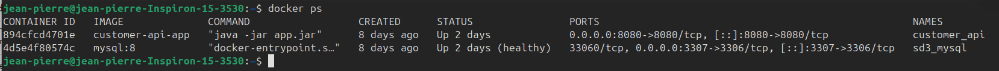
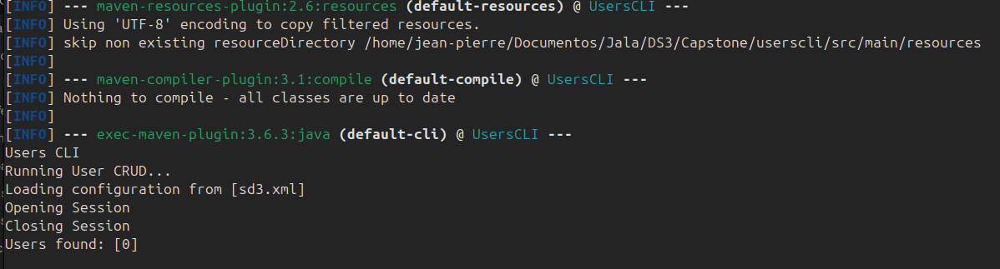
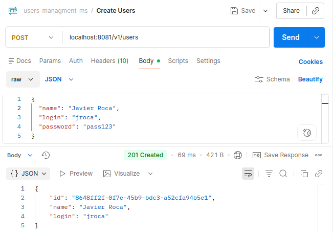
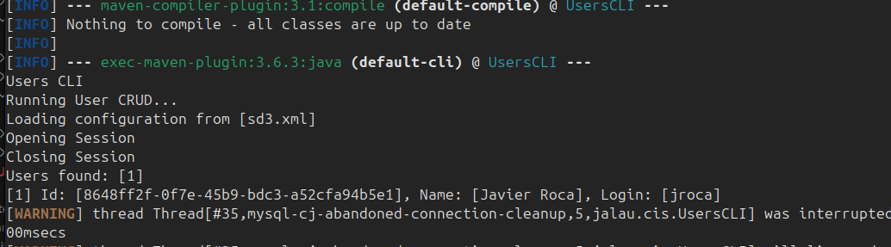
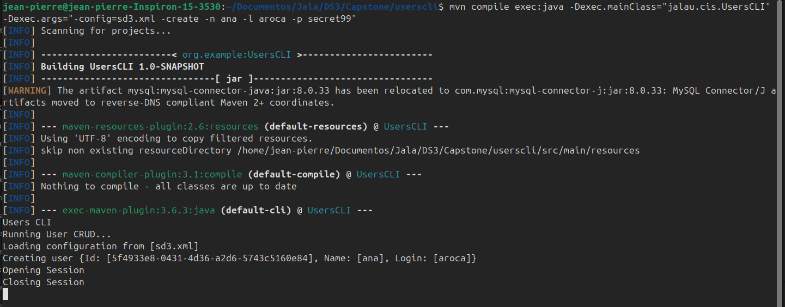
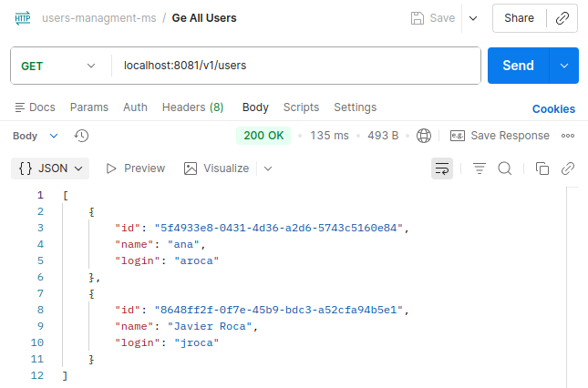
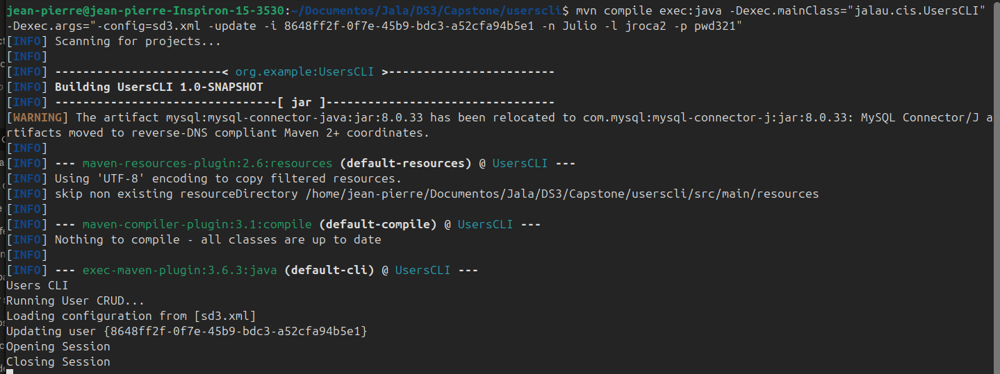
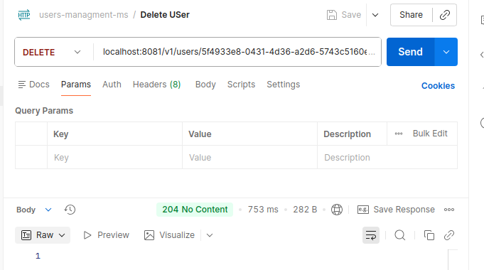
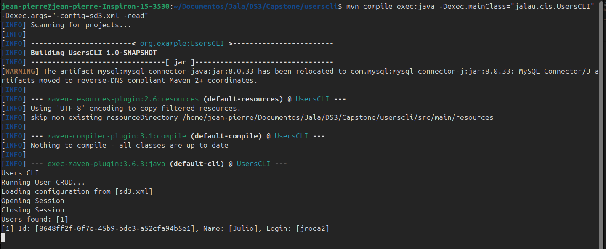

# Integration Evidence: Legacy CLI & API

**Project:** Users CLI — Software Development 3  
**Date:** 2026-03-18  
**Purpose:** Demonstrate that the legacy CLI continues to operate correctly after API connection and development, with no modifications to its codebase.

---

## 1. Environment Setup

| Component | Detail |
|---|---|
| Database | MySQL 8 via Docker Compose (`sd3_mysql`) |
| Schema | `sd3`.`users` |
| CLI | Java Maven project — `jalau.cis.UsersCLI` |
| API | Spring Boot — `user_management_api` |
| DB Port | `3307:3306` |

Docker Compose services running:



---

## 2. Legacy CLI — No Code Modifications

> The CLI source code was not modified at any point during API development.

The CLI connects directly to the same `sd3` database using `sd3.xml`:

```xml
<property name="url"      value="jdbc:mysql://localhost:3307/sd3" />
<property name="username" value="SOME_USER" />
<property name="password" value="SOME_PASSWORD" />
```

---

## 3. Test Cases

### 3.1 CLI — Read (baseline, empty DB)

**Command:**
```bash
mvn compile exec:java -Dexec.mainClass="jalau.cis.UsersCLI" -Dexec.args="-config=sd3.xml -read"
```

**Output:**



CLI operates correctly against the database.

---

### 3.2 API — Create User

**Request:**
```http
POST http://localhost:8081/v1/users
Content-Type: application/json

{
  "name": "Javier Roca",
  "login": "jroca",
  "password": "pass123"
}
```

**Response `201 Created`:**



API creates user successfully in the shared `sd3` database.

---

### 3.3 CLI — Read After API Create *(Cross-functional)*

**Command:**
```bash
mvn compile exec:java -Dexec.mainClass="jalau.cis.UsersCLI" -Dexec.args="-config=sd3.xml -read"
```

**Output:**



CLI correctly reads the user created by the API — cross-functional operation confirmed.

---

### 3.4 CLI — Create User

**Command:**
```bash
mvn compile exec:java -Dexec.mainClass="jalau.cis.UsersCLI" -Dexec.args="-config=sd3.xml -create -n ana -l aroca -p secret99"
```

**Output:**



CLI creates a new user directly in the database.

---

### 3.5 API — Read After CLI Create *(Cross-functional)*

**Request:**
```http
GET http://localhost:8081/v1/users
```

**Response `200 OK`:**



API correctly reads the user created by the CLI — cross-functional operation confirmed.

---

### 3.6 CLI — Update User

**Command:**
```bash
mvn compile exec:java -Dexec.mainClass="jalau.cis.UsersCLI" -Dexec.args="-config=sd3.xml -update -i 8648ff2f-0f7e-45b9-bdc3-a52cfa94b5e1 -n Julio -l jroca2 -p pwd321"
```

**Output:**



CLI updates existing user without errors.

---

### 3.7 API — Delete User

**Request:**
```http
DELETE http://localhost:8081/v1/users/5f4933e8-0431-4d36-a2d6-5743c5160e84
```

**Response `204 No Content`**


API deletes the user created by the CLI.

---

### 3.8 CLI — Read Final State *(Cross-functional)*

**Command:**
```bash
mvn compile exec:java -Dexec.mainClass="jalau.cis.UsersCLI" -Dexec.args="-config=sd3.xml -read"
```

**Output:**



CLI reflects all changes made by the API — final state is consistent.

---

## 5. Conclusions

- The **legacy CLI operates correctly** after API development, with zero errors.
- **No modifications** were made to the CLI source code.
- **Cross-functional operations** work correctly in both directions:
  - Records created via API are readable by the CLI.
  - Records created via CLI are readable by the API.
- Both systems share the same `sd3` database seamlessly.

---